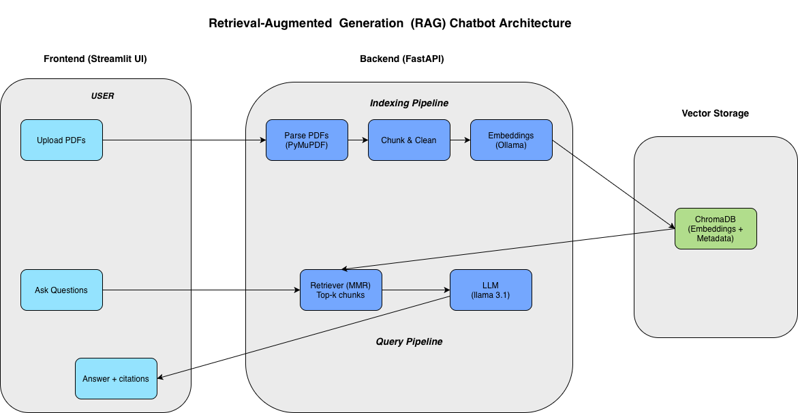

# 🤖 AI-Powered RAG Chatbot

*Ask questions about your documents and get grounded, citation-backed answers powered by Retrieval-Augmented Generation (RAG).*

---

## 🚀 Overview

This project is a **production-oriented Retrieval-Augmented Generation (RAG) system**.

Retrieval-Augmented Generation improves reliability by grounding model responses in retrieved documents rather than relying solely on model memory, reducing hallucinations.

Users can upload multiple PDFs, ask questions, and receive **AI-generated answers grounded in retrieved source chunks with citations**.

The system is built with a **clean modular architecture**, supports containerized deployment using **Docker and Docker Compose**, and includes **end-to-end testing**, making it suitable for real-world workflows and as a portfolio demonstration of production-oriented LLM systems.

---

## ✨ Key Features

- 📄 PDF ingestion using **PyMuPDF**
- ✂️ Paragraph & sentence-aware chunking
- 🧠 Vector search with **ChromaDB**
- 🔎 **MMR retrieval** to improve result diversity
- 📚 Source previews and citations in UI
- ⚡ FastAPI backend
- 🖥 Streamlit frontend
- 🐳 Dockerized deployment
- 🧪 End-to-end smoke test

---

## 🏗 Architecture Overview



The system follows a modular Retrieval-Augmented Generation pipeline:

- PDFs are parsed and chunked before embedding.
- Embeddings with metadata are stored in ChromaDB.
- MMR retrieval selects diverse, relevant chunks.
- Retrieved context is sent to the LLM for grounded generation.
- The Streamlit UI displays answers with citations.

---

## 📂 Screenshots

Demo screenshots and UI examples:
📸 [View Screenshots (PDF)](https://github.com/Sah-Pranav/AI-Power-Rag-ChatBot/blob/main/screenshot/screenshots.pdf)

---

## ⚙️ Prerequisites

- Python **3.11+**
- **Ollama** running locally (for embeddings + LLM)
- Docker (optional but recommended)

Pull models:

```bash
ollama pull llama3.1
ollama pull nomic-embed-text
```

### Installation & Setup
Clone the repository and install dependencies:

```bash
git clone https://github.com/Sah-Pranav/AI-Power-Rag-ChatBot
cd AI-Power-Rag-ChatBot
pip install -r requirements.txt
```


## Run Locally

You can run the app in two ways:

**Option A: Using Docker (Recommended)**

```bash
docker-compose up --build
```
Open:
- Frontend: http://localhost:8501
- API Docs: http://localhost:8000/docs

**Option B: Manual Run**

Terminal 1 (Backend):
```bash
uvicorn api.main:app --reload --port 8000
```

Terminal 2 (Frontend):
```bash
streamlit run frontend/app.py
```
---
## 🧪 Smoke Test
Run an end-to-end validation of the full ingestion -> retrieval -> generation pipeline
```bash
python -m tests.test_smoke ./docs/sample.pdf 
```

You can replace `sample.pdf` with your own document.

---
## 📂 Project Structure
```bash
api/            # FastAPI routes and service layer
app/            # Core RAG pipeline (ingestion, retrieval, generation)
frontend/       # Streamlit UI
tests/          # End-to-end smoke tests
config/         # YAML configuration
scripts/        # Utility scripts
data/           # Vector DB persistence (gitignored)
logs/           # Application logs (gitignored)
```
---

## 🔧 Configuration
Edit config/config.yaml to switch models or retrieval strategy.

**Default configuration**

- Embeddings: `nomic-embed-text` (Ollama)
- LLM: `llama3.1` (Ollama)
- Retrieval: `MMR` (recommended)

---
## Tech Stack


---

## 👨‍💻 Developed By **Pranav Sah**